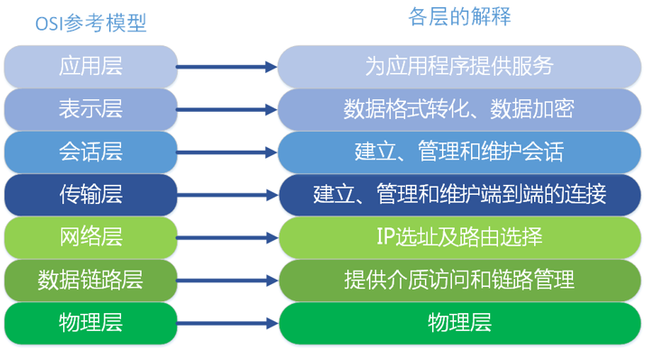
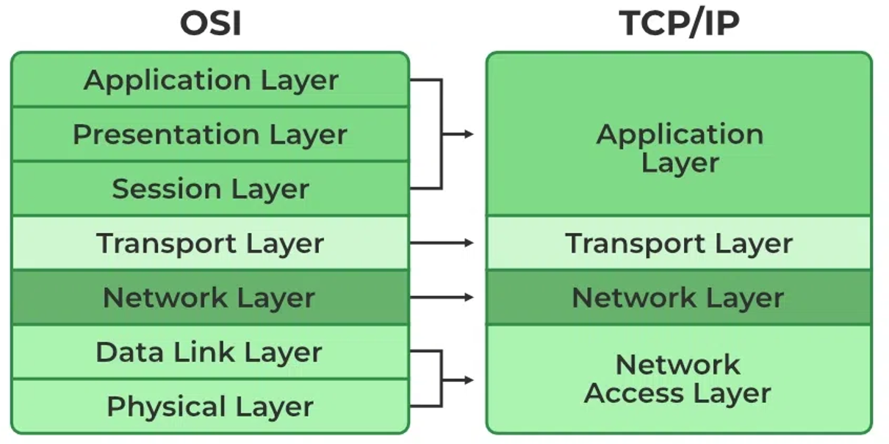
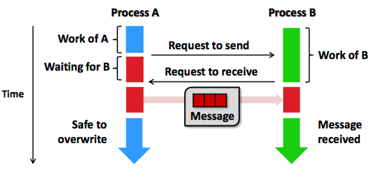
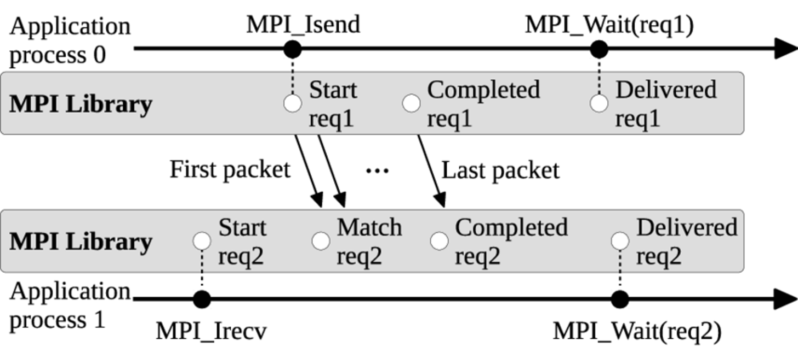
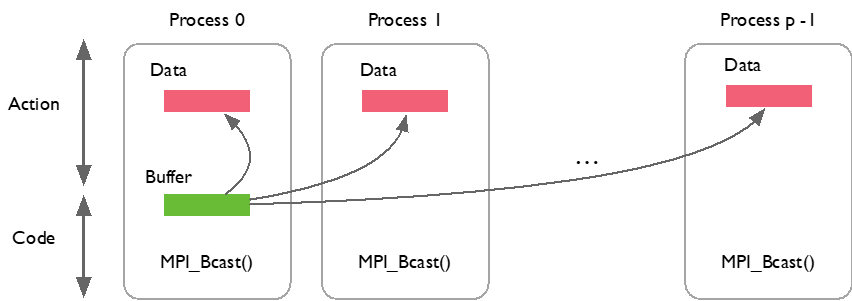
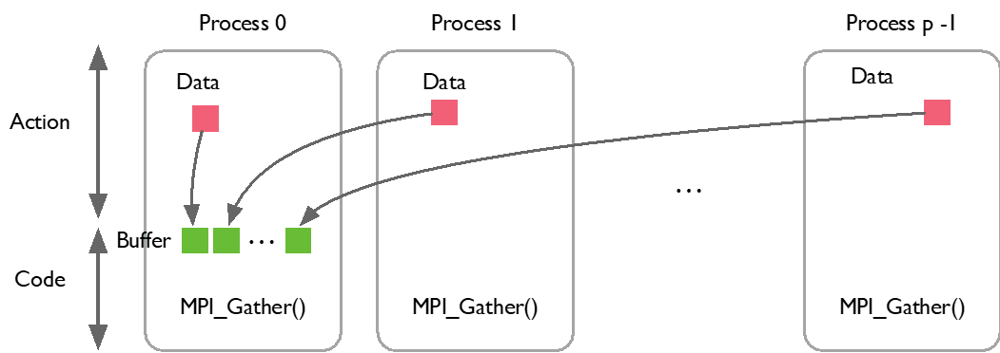
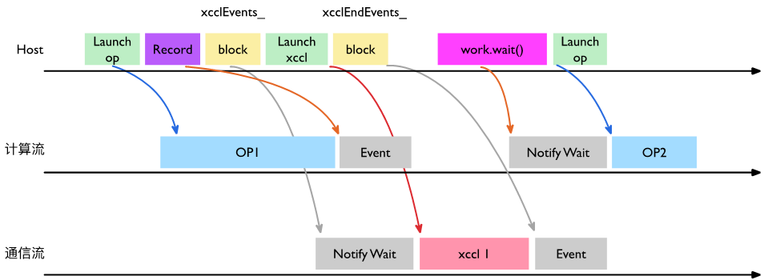
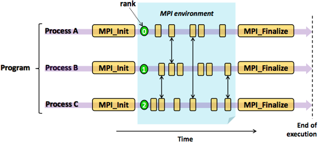

# MPI 通信与通信库

在大模型系统中，集合通信（Collective communication）尤为重要，业界比较重要的就是 MPI/OpenMPI。MPI 是集合通信库 XCCL 的基础，包含了很多基本概念和基础 API 定义，方便入门和进一步了解英伟达的 NCCL 和华为的 HCCL。因此本节主要讲解什么是 MPI，在 MPI 通信中有三个比较重要的概念：（1）P2P（Per2Per）通信，也称为点对点通信；（2）CC，collective communication，集合通信；（3）PM（program management），集合通信中的程序和 API。

## MPI 通信基本概念

MPI（Message Passing Interface）是一个跨语言的通讯协议，是高性能计算领域不可或缺的消息传递标准。它通过提供一套高效、可移植、功能丰富的通信原语，使得程序员能够在由数千甚至数百万个处理器组成的庞大分布式内存系统上编写复杂的并行应用程序。

在 1992 年超算大会上定义了第一个消息传递接口的标准，并在 1994 年完成了完整的接口标准（MPI-1）。如今 MPI 已经发展到 MPI-4.0 并提供了应用程序接口 API，包括协议和通信语义。支持语义丰富的消息通信机制，包括点对点、组播和多播模式。MPI 标准规定了基于消息传递的并行编程 API 的调用规范和语义，不同的实现采用不同优化策略。

MPI 与 TCP/IP 网络协议本身没有直接关系，OSI 参考模型包括应用层、表示层、会话层、传输层、网络层、数据链路层和物理层，一共 7 层。在 TCP/IP 网络协议中只要 4 层，MPI 属于 OSI 参考模型第五层或者更高，MPI 实现可以通过传输层 sockets 和 TCP，大部分 MPI 实现由指定 API 组成。



OSI 模型，即开放式通信系统互联参考模型（Open Systems Interconnection Reference Model），国际标准化组织提出一个试图使各种计算机在世界范围内互连的网络标准框架，简称 OSI。由于 OSI 模型并没有提供可实现方法，只是概念描述，用来协调进程间通信。即 OSI 模型并不是标准，而是制定标准时所使用的概念性框架，事实上网络标准是 TCP/IP。



在开始正式介绍 MPI 之前，先解释 MPI 消息传递模型相关的核心概念，重要概念包括进程、通信器、秩和标签等。

| 概念 | 英文 | 解释 |
| --- | --- | --- |
| 进程 | Process |  MPI 程序由一组 N 个独立的进程组成。每个进程有自己的地址空间（内存）、程序计数器和堆栈。它们通常（但不一定）运行在不同的物理处理器或计算节点上 |
| 通信器 | Communicator | MPI 最核心的概念之一。它是一个通信上下文，定义了一组可以互相通信的进程以及它们之间的拓扑关系。最重要的通信器是 MPI_COMM_WORLD，它包含了程序启动时创建的所有进程 |
| 进程组 | Group | 通信器包含一个有序的进程集合（进程组） |
| 上下文 | Context | 确保在不同通信器中的通信不会相互干扰（即使涉及相同的进程组） |
| 秩 | Rank | 在给定的通信器内，每个进程被分配一个唯一的整数标识符，称为它的“秩”(Rank)，范围从 0 到 N-1（N 是通信器包含的进程总数）。进程通常通过 Rank 来指定通信的源或目标 |
| 消息 | Message | 进程间通信的基本单位，一条消息包含数据缓冲区、数据类型、数量、目标/源、标签 |
| 数据缓冲区 | Buffer | 包含要发送或接收的实际数据的连续内存区域 |
| 数据类型 | Datatype | 描述缓冲区中数据的布局（如 MPI_INT, MPI_DOUBLE，或用户自定义的派生类型），MPI 可以处理非连续内存（如数组的某一行、列或子块），这是其强大功能之一 |
| 数量 | Count | 数据类型的个数 |
| 目标/源 | Destination/Source | 接收/发送消息的进程 Rank |
| 标签 | Tag |  一个用户定义的整数，用于区分不同类型的消息（例如，区分边界数据和全局汇总指令） |
| 通信模式 | Communication Modes | 包含点对点通信（Point-to-Point Communication）和集体通信（Collective Communication） |

通讯器定义了一组能够互相发消息的进程，在这组进程中，每个进程会被分配一个序号（秩），进程间显性地通过指定秩来进行通信。通信的基础建立在不同进程间发送和接收操作。一个进程可以通过指定另一个进程的秩以及一个独一无二的消息标签来发送消息给另一个进程。

接受者可以发送一个接收特定标签标记的消息的请求（或者也可以完全不管标签，接收任何消息），然后依次处理接收到的数据。类似这样的涉及一个发送者以及一个接受者的通信被称作点对点通信。当然在很多情况下，某个进程可能需要跟所有其他进程通信。比如主进程想发一个广播给所有的从进程。在这种情况下，手动去写每一个进程分别进行点对点的信息传递就显得很笨拙，而且也会导致网络利用率低下，MPI 则有专门的接口处理这类所有进程间的集体通信。

## Per2Per

点对点通信是在两个特定进程（一个发送者，一个接收者）之间进行消息传递。这是最基本的通信模式，用于控制同步或者数据传输，如 MPI_Send 和 MPI_Recv 分别实现了用于发送数据和接收数据的逻辑。通信采用的方式是两个进程计算结束后，相互交换消息前需要请求访问，再进行下一阶段计算。



点对点通信分为同步和异步两种，同步阻塞 （Blocking）是发送/接收函数调用在消息操作（发送完成被对方接收/接收完成数据可用）安全完成之前不会返回，例如 MPI_Send 和 MPI_Recv。MPI_Send 返回意味进程发送数据结束，进程缓冲可以重用或覆盖，但不代表 Receiver 收到数据。MPI_Recv 返回意味着数据已经接收到进程的缓冲区，可以使用。



异步非阻塞（Non-blocking） 是发送/接收函数调用立即返回一个“请求句柄”，而实际的通信操作在后台进行。程序员随后需要使用 MPI_Wait 或 MPI_Test 等函数来查询或等待操作完成，例如 MPI_Isend 和 MPI_Irecv。非阻塞通信的意义在于进程发送或接收操作后马上返回，继续后续阶段的计算。当程序要求操作必须确认完成时，调用相应测试接口 MPI_Wait 阻塞等待操作完成。异步编程相对复杂，但使得计算和通信可以一定程度并行，降低数据同步带来的运行时开销，是实现通信与计算重叠、提高性能的关键。

## 集合通信

集体通信是在通信器内所有进程（或一个定义的子集）之间进行的协调操作，这些操作比用点对点操作手动实现更高效、更简洁。包括了一对多、多对一和多对多的通信方式，常用于一组进程之间的数据交换，包括通信、规约和同步三种类型。常见操作包括同步 (Barrier)、广播 (Broadcast)、收集 (Gather)、散播 (Scatter)、全局归约 (Reduce)、全归约 (Allreduce)、全收集 (Allgather)和扫描/前缀归约 (Scan/Prefix Reduction)。不同通信类型使用通信原语的方式进行表示，MPI 通信中不同函数名对应的含义如下表所示。

<table>
    <tr>
        <td>类型</td>
        <td>函数名</td>
        <td>含义</td>
    </tr>
    <tr>
        <td rowspan="9">通信</td>
        <td>MPI_Bcast</td>
        <td>一对多广播相同消息，一个进程（根进程）将其数据发送给通信器内所有其他进程</td>
    </tr>
    <tr>
        <td>MPI_Gather</td>
        <td>多对一收集各进程消息，所有进程将各自的数据发送到一个指定的根进程，根进程按 Rank 顺序收集所有数据</td>
    </tr>
    <tr>
        <td>MPI_Gatherv</td>
        <td>MPI_Gather 一般化</td>
    </tr>
    <tr>
        <td>MPI_Allgather</td>
        <td>全局收集,每个进程收集所有其他进程的数据（相当于 Gather + Bcast 结果给所有进程）</td>
    </tr>
    <tr>
        <td>MPI_Allgatherv</td>
        <td>MPI_Allgather 一般化</td>
    </tr>
    <tr>
        <td>MPI_Scatter</td>
        <td>一对多散播不同消息，根进程将其数据块分割并发送给通信器内的所有其他进程（包括自己）</td>
    </tr>
        <tr>
        <td>MPI_Scatterv</td>
        <td>MPI_Scatter 一般化</td>
    </tr>
    <tr>
        <td>MPI_Alltoall</td>
        <td>多对多全局交换信息</td>
    </tr>
    <tr>
        <td>MPI_Alltoallv</td>
        <td>MPI_Alltoall 一般化</td>
    </tr>
    <tr>
        <td rowspan="4">规约</td>
        <td>MPI_Reduce</td>
        <td>多对一规约，所有进程提供数据，使用指定的操作（如求和 MPI_SUM、求最大值 MPI_MAX、求最小值 MPI_MIN 等）进行归约计算，结果存储在根进程</td>
    </tr>
    <tr>
        <td>MPI_Allreduce</td>
        <td>MPI_Reduce 一般化，与 Reduce 类似，但归约结果会广播给所有进程</td>
    </tr>
    <tr>
        <td>MPI_Reduce_scatter</td>
        <td>MPI_Reduce 一般化</td>
    </tr>
    <tr>
        <td>MPI_Scan</td>
        <td>前缀和，对进程 Rank 顺序执行前缀归约操作</td>
    </tr>
    <tr>
        <td>同步</td>
        <td>MPI_Barrier</td>
        <td>所有进程在此处等待，直到所有进程都到达该点</td>
    </tr>
</table>


当 MPI 进程启动后，每个进程会分配唯一的序号 Rank。集合通信需要指定一个协调者（Rank 0 Process，一般称为 ROOT），由其负责将数据发送给所有进程。以 MPI_Bcast 为例来解析一对多广播相同消息是如何实现的，它将数据从根进程发送到所有其它进程，所有进程都调用 MPI_Bcast。如下代码实现了一个使用 MPI_Bcast 广播数据的过程。

```c
# Broadcast 100 ints from process 0 to every process in the group

MPI_Comm comm;
int array[100];
int root=0;

MPI_Bcast(array, 100, MPI_INT, root, comm);
```

虽然每个进程都调用 MPI_Bcast，但根进程负责广播数据，其它进程接收数据。当进程调用 MPI_Bcast，执行的时候会把 MPI_Bcast 里面主进程的数据一一发送到对应的其它进程，或者其它卡上面的缓冲区。



MPI_Gather 行为与 MPI_Bcast 恰好相反，每个进程将数据发送给根进程。如下代码实现了一个典型数据聚合过程：
如下图所示，当启动 MPI_Gather 时，每个进程（process 0~p-1）里面对应的数据全部汇聚到第一个进程中，也就是主进程（Root），通过 MPI_Bcast 和 MPI_Gather 可以看出 MPI 相关 API 所做的操作。



```c
MPI_Comm comm;
int gsize,sendarray[100];
int root, myrank, *rbuf;

MPI_Comm_rank(comm, &myrank);
if (myrank == root) {
    MPI_Comm_size(comm, &gsize);
    rbuf = (int *)malloc(gsize*100*sizeof(int));
}
MPI_Gather(sendarray, 100, MPI_INT, rbuf, 100, MPI_INT, root, comm);
```

MPI 集合通信编程模式就是当每个程序独立完成计算后，到达交汇点，同时调用集合通信原语（Primitive）完成数据通信，然后根据结果进行后续计算。当计算规模较大，集合通信性能非常关键，不同 MPI 实现框架有不同优化方案。实际工程应用中，往往采用更复杂拓扑结构来提升性能，例如树形结构、环形结构。

在 MPI 中有个很重要的概念就是同步（Barrier），在某些场景下，多个进程需要协调同步进入某个过程。MPI 提供了同步原语例如 MPI_Barrier，所有进程调用 MPI_Barrier，阻塞程序直到所有进程都开始执行这个接口，然后返回。同步的作用就是让所有进程确保 MPI_Barrier 之前的工作都已完成，同步进入下一个阶段。



## MPI 程序运行

MPI 程序编程模式为迭代式“计算 + 通信”，程序可以分为计算块和通信块。每个程序可以独立完成计算块，计算完成后进行交互（通信或同步）。交互后进入下一阶段计算，直到所有任务完成，程序退出。



以下是一个 MPI Hello World 程序，MPI 程序的第一步是引入 #include <mpi.h> 这个头文件，主函数在进行 MPI_Init 的过程中，所有 MPI 的全局变量或者内部变量都会被创建。MPI_Comm_size 会返回 MPI_COMM_WORLD 这个通信器的大小，也就是当前 MPI 任务中所有的进程数目。MPI_Comm_rank 函数会返回通信器中当前进程的秩，MPI_Get_processor_name 会得到当前进程实际跑的时候所在的处理器名字，最后使用 MPI_Finalize 清除当前 MPI 环境。

```c
#include <mpi.h>
#include <stdio.h>

int main(int argc, char** argv) {
    // 初始化 MPI 环境
    MPI_Init(NULL, NULL);

    // 通过调用以下方法来得到所有可以工作的进程数量
    int world_size;
    MPI_Comm_size(MPI_COMM_WORLD, &world_size);

    // 得到当前进程的秩
    int world_rank;
    MPI_Comm_rank(MPI_COMM_WORLD, &world_rank);

    // 得到当前进程的名字
    char processor_name[MPI_MAX_PROCESSOR_NAME];
    int name_len;
    MPI_Get_processor_name(processor_name, &name_len);

    // 打印一条带有当前进程名字，秩以及
    // 整个 communicator 的大小的 hello world 消息。
    printf("Hello world from processor %s, rank %d out of %d processors\n",
           processor_name, world_rank, world_size);

    // 释放 MPI 的一些资源
    MPI_Finalize();
}
```

MPI 框架只提供通信机制，即任务间同步和通信手段，与计算无关。计算任务如何分解和实现，数据如何划分，任务如何合并等问题由程序开发者决定。MPI 框架在程序启动时为每个程序副本分配唯一 Rank ID，程序通过获取和根据 Rank 确定任务。之后可以执行以下 Makefile 文件进行编译并在配置了 MPICC 运行环境的多个节点的集群上面执行 MPI 程序。

```c
EXECS=mpi_hello_world
MPICC?=mpicc

all: ${EXECS}

mpi_hello_world: mpi_hello_world.c
    ${MPICC} -o mpi_hello_world mpi_hello_world.c

clean:
    rm ${EXECS}
```

一个典型的 MPI 程序由用户程序部分（MPI User）链接 MPI 库（MPI Interface）构成，计算任务本身的算法实现、任务分解和合并实现在用户程序部分，与 MPI 无关，也不受 MPI 限制。因此 MPI 提供给开发者灵活性，实现了最小封装。


## 小结

MPI 是集合通信库 XCCL 的基础，其中包含了很多基本概念和基础 API 定义，OpenMPI 作为早期的开源集合通信库，定义了 P2P 通信、集合通信和对应的程序运行。通过对 MPI 相关定义和实现可以更好地理解之后英伟达的 NCCL 和华为的 HCCL。

## 本节视频

<html>
<iframe src="https://player.bilibili.com/player.html?isOutside=true&aid=1456308800&bvid=BV1Di421h7u2&cid=1651238864&p=1" width="100%" height="500" scrolling="no" border="0" frameborder="no" framespacing="0" allowfullscreen="true"> </iframe>
</html>
